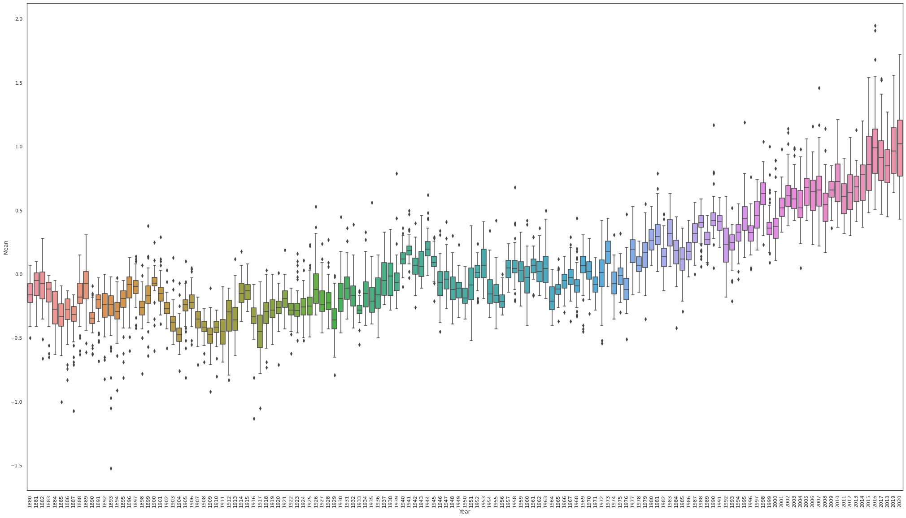
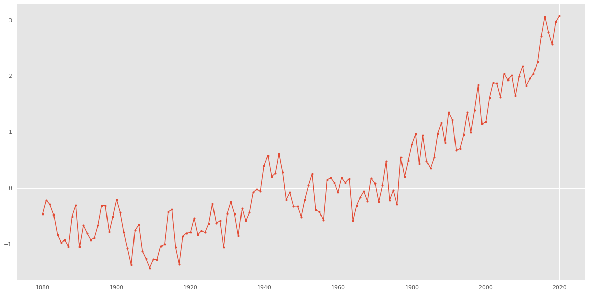

# **Graphic_analysis_Global_temperature_Changes**
The following repository serves to make Primary graphical analysis of the average temperature change in the world over the years
Most of the Graphics considere 2d variables and intend to analyse the average temperature changes grouped by Hemisphere or simply the average change on selected months 
Example image: 

